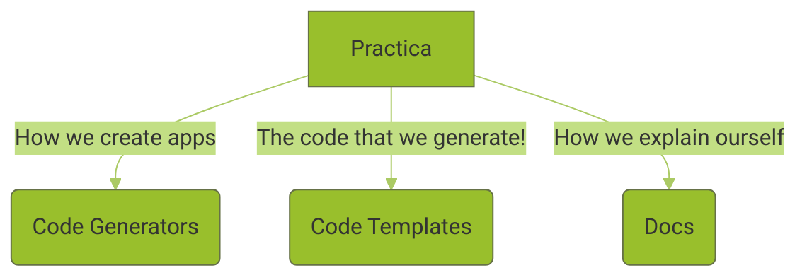
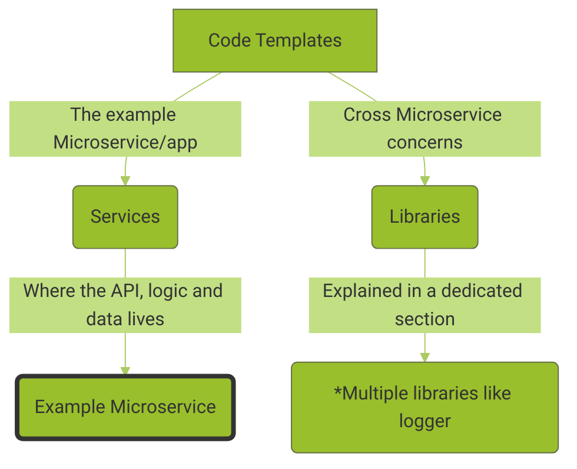
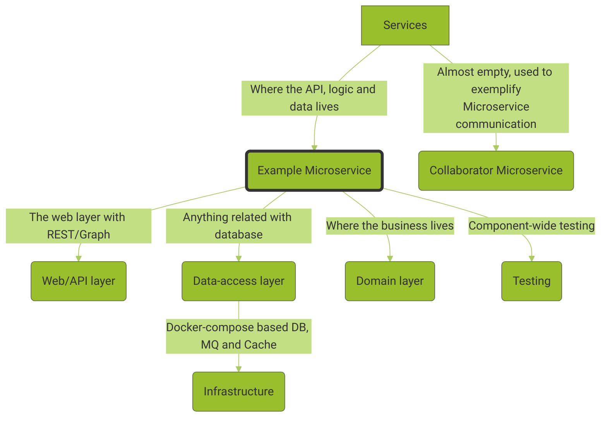
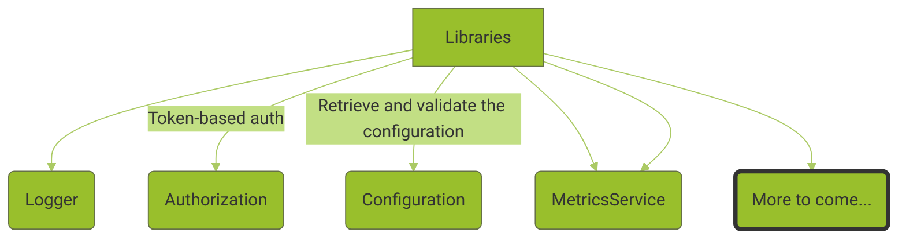

# How do we work together?

## You belong with us

If you reached down to this page, you probably belong with us 💜. We are in an ever-going quest for better software practices. This journey can bring two things to your benefit: A lot of learning and global impact on many people's craft. Does this sounds attractive?

## Consider the shortened guide first

Every small change can make this repo much better. If you intend to contribute a relatively small change like documentation change, small code enhancement or anything that is small and obvious - start by reading the [shortened guide here](/docs/docs/contribution/contribution-short-guide.md). As you'll expand your engagement with this repo, it might be a good idea to visit this long guide again


## Philosophy

Our main selling point is our philosophy, our philosophy is 'make it SIMPLE'. There is one really important holy grail in software - Speed. The faster you move, the more features and value is created for the users. The faster you move, more improvements cycles are deployed and the software/ops become better. [Researches show](https://puppet.com/resources/report/2020-state-of-devops-report) that faster team produces software that is more reliable. Complexity is the enemy of speed - Commonly apps are big, sophisticated, has a lot of internal abstractions and demand long training before being productive. Our mission is to minimize complexity, get onboarded developers up to speed quickly, or in simple words - Let the reader of the code understand it in a breeze. If you make simplicity a 1st principle - Great things will come your way.


Big words, how exactly? Here are few examples:

**- Simple language -** We use TypeScript because we believe in types, but we minimize advanced features. This boils down to using functions only, sometimes also classes. No abstracts, generic, complex types or anything that demand more CPU cycles from the reader.

**- Less generic -** Yes, you read it right. If you can code a function that covers less scenarios but is shorter and simpler to understand - Consider this option first. Sometimes one if forced to make things generic - That's fine, at least we minimized the amount of complex code locations

**- Simple tools -** Need to use some 3rd party for some task? Choose the library that is doing the minimal amount of work. For example, when seeking a library that parses JWT tokens - avoid picking a super-fancy framework that can solve any authorization path (e.g., Passport). Instead, Opt for a library that is doing exactly this. This will result in code that is simpler to understand and reduced bug surface

**- Prefer Node/JavaScript built-in tooling -** Some new frameworks have abstractions over some standard tooling. They have their way of defining modules, libraries and others which demand learning one more concept and being exposed to unnecessary layer of bugs. Our preferred way is the vanilla way, if it's part of JavaScript/Node - We use it. For example, should we need to group a bunch of files as a logical modules - We use ESM to export the relevant files and functions

<!-- [Our full coding guide will come here soon](./docs/coding-guide.md) -->


## Workflow

### Got a small change? Choose the fast lane

Every small change can make this repo much better. If you intend to contribute a relatively small change like documentation change, linting rules, look&feel fixes, fixing TYPOs, comments or anything that is small and obvious - Just fork to your machine, code, ensure all tests pass (e.g., `npm test`), PR with a meaningful title, get **1** approver before merging. That's it.


### Need to change the code itself? Here is a typical workflow

|          	| **➡️ Idea**                                                                                                                                                                                                                                            	| **➡ Design decisions**                                                                                                                                                                                                                                                   	| **➡ Code**                                                                                                                                                                                	| **➡️ Merge**                                                                                                                                                                                                                                        	|
|----------	|-------------------------------------------------------------------------------------------------------------------------------------------------------------------------------------------------------------------------------------------------------	|--------------------------------------------------------------------------------------------------------------------------------------------------------------------------------------------------------------------------------------------------------------------------	|-------------------------------------------------------------------------------------------------------------------------------------------------------------------------------------------	|----------------------------------------------------------------------------------------------------------------------------------------------------------------------------------------------------------------------------------------------------	|
| **When** 	| Got an idea how to improve? Want to handle an existing issue?                                                                                                                                                                                         	| When the change implies some major decisions, those should be discussed in advance                                                                                                                                                                                       	| When got confirmation from core maintainer that the design decisions are sensible                                                                                                         	| When you have accomplished a *short iteration* . If the whole change is small, PR in the end                                                                                                                                                       	|
| **What** 	| **1.** Create an issue (if doesn't exist) <br/>  **2.** Label the issue with the its type (e.g., question, bug) and the area of improvement (e.g., area-generator, area-express)  <br/>   **3.** Comment and specify your intent to handle this issue 	| **1.** Within the issue, specify your overall approach/design. Or just open a discussion **2.** If choosing a 3rd party library, ensure to follow our standard decision and comparison template. [Example can be found here](./docs/decisions/configuration-library.md)  	| **1.** Do it with passions 💜 <br/>  **2.** Follow our coding guide. Keep it simple. Stay loyal to our philosophy <br/>  **3.** Run all the quality measures frequently (testing, linting) 	| **1.** Share your progress early by submit a [work in progress PR](https://github.blog/2019-02-14-introducing-draft-pull-requests/) <br/>  **2.** Ensure all CI checks pass (e.g., testing) <br/>  **3.** Get at least one approval before merging 	|

## Roles


## Project structure

### High-level sections

The repo has 3 root folders that represents what we do:

- **docs** - Anything we write to make this project super easy to work with
- **code-generator** - A tool with great DX to choose and generate the right app for the user
- **code-templates** - The code that we generate with the right patterns and practices



### The code templates

Typically, the two main sections are the Microservice (apps) and cross-cutting-concern libraries:



**The Microservice structure**


The entry-point of the generated code is an example Microservice that exposes API and has the traditional layers of a component:



**Libraries**

All libraries are independent npm packages that can be testing in isolation



### The code generator structure

## Packages (domains)

This solution is built around independent domains that share _almost_ nothing with others. It is recommended to start with understanding a single and small domain (package), then expanding and getting acquainted with more. This is also an opportunity to master a specific topic that you're passionate about. Following is our packages list, choose where you wish to contribute first


| **Package**                      	| **What**                                                  	| **Status**                                          	| **Chosen libs**                                                                                                                                                                         	| **Quick links**                             	|
|----------------------------------	|-----------------------------------------------------------	|-----------------------------------------------------	|-----------------------------------------------------------------------------------------------------------------------------------------------------------------------------------------	|---------------------------------------------	|
| microservice/express             	| A web layer of an example Microservice based on expressjs 	| 🧓🏽 Stable                                           	| -                                                                                                                                                                                       	| - [Code & readme]()<br>- [Issues & ideas]() 	|
| microservice/fastify             	| A web layer of an example Microservice based on Fastify   	| 🐣 Not started<br><br>(Take the heel, open an issue) 	| -                                                                                                                                                                                       	| - [Code & readme]()<br>- [Issues & ideas]() 	|
| microservice/dal/prisma          	| A DAL layer of an example Microservice based on Prisma.js 	| 🐥 Beta/skeleton                                     	| -                                                                                                                                                                                       	| - [Code & readme]()<br>- [Issues & ideas]() 	|
| library/logger                   	| A logging library wrapper                                 	| 🐥 Beta/skeleton<br><br>(Take it!)                   	| [Pino](https://github.com/pinojs/pino)<br><br>Why: [Decision here]()                                                                                                                    	| - [Code & readme]()<br>- [Issues & ideas]() 	|
| library/configuration            	| A library that validates, reads and serve configuration   	| 🧒🏻 Solid<br><br>(Improvements needed)               	| [Convict](https://www.npmjs.com/package/convict)<br><br>Why: [Decision here](https://github.com/bestpractices/practica/blob/main/docs/decisions/configuration-library.md)               	| - [Code & readme]()<br>- [Issues & ideas]() 	|
| library/jwt-based-authentication 	| A library that authenticates requests with JWT token      	| 🧓🏽 Stable                                           	| [jsonwebtoken](https://www.npmjs.com/package/jsonwebtoken)<br><br>Why: <br>[Decision here](https://github.com/bestpractices/practica/blob/main/docs/decisions/configuration-library.md) 	| - [Code & readme]()<br>- [Issues & ideas]() 	|


## Development machine setup

✅ Ensure Node, Docker and [NVM](https://github.com/nvm-sh/nvm#installing-and-updating) are installed

✅ Configure GitHub and npm 2FA!

✅ Clone the repo if you are a maintainer, or fork it if have no collaborators permissions

✅ With your terminal, ensure the right Node version is installed:

```
nvm use
```

✅ Install dependencies:


```
npm i
```

✅ Ensure all tests pass:

```
npm t
```

✅ Code. Run the test. And vice versa


## Areas to focus on


## Supported Node.js version

- The generated code should be compatible with Node.js versions >14.0.0.
- It's fair to demand LTS version from the repository maintainers (the generator code)


## Code structure

Soon
