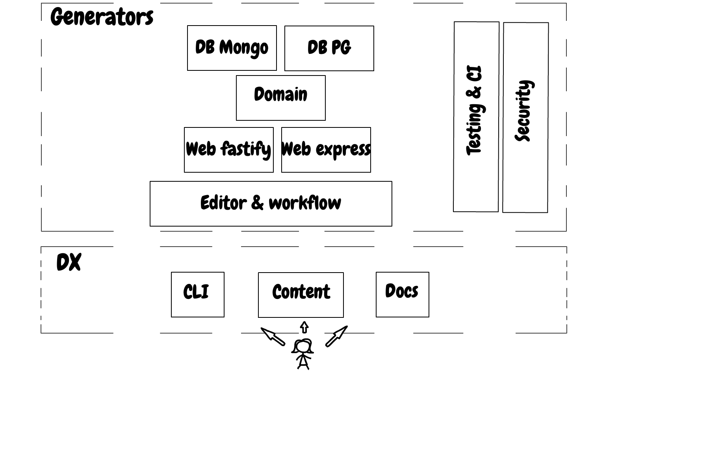

# WE are thirilled to have you here

Couple of sentences

## The mission statement of this project

Couple of sentences

## Contribution levels

### Steering committee

A marketing-based list with no rights

### Core team

Who: Whomever the core team votes to join. Steering companies get 4 seats upfront

Responsibilities: Any other votes, allowed to approve PRs, first on the list, master a domain, 2 votes in ongoing decisions

### Collaborators

Votes in ongoing decisions, two are needed to approve PR

### Owner

Admin right in the repo, right to choose partners and change the project fundamentals

### Domain masters

This project is organized into multiple areas of knowledge and responsibility. Each domain is assigned multiple collaborators and one person who manage the domain. This is the domain master

**- Docs**

Responsible for 

Domain master: John Doe

**- CLI**

Responsible for 

Domain master: John Doe

**- Postgres DB**

Responsible for 

Domain master: John Doe

**- Mongo DB**

Responsible for 

Domain master: John Doe

**- Web layer express**

Responsible for 

Domain master: John Doe

**- Web layer fastify**

Responsible for 

Domain master: John Doe

**- Domain layer**

Responsible for 

Domain master: John Doe

**- Security**

Responsible for 

Domain master: John Doe

## Domains

