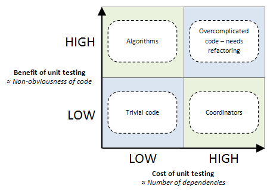
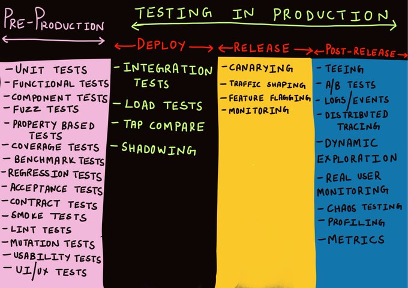

## What's special about this article?

As a testing consultant, I read tons of testing articles throughout the years. The majority is nice-to-read, casual pieces of content which not always worth your precious time. Once in a while, not very often, I landed on an article that was _shockingly good_ and could genuinely improve your test writing skills. I've cherry-picked these outstanding articles for you, and added my abstract nearby. Half of these articles are related directly to JavaScript/Node.js, the second half covers ubiquitous testing concepts that are applicable in every language

Why did I find these articles to be outstanding? First, the writing quality is excellent. Second, they deal with the 'new world of testing', not the commonly known 'TDD-ish' stuff but rather modern concepts and tooling

Too busy to read them all? Search for articles that are decorated with a medal 🏅, these are a true masterpiece pieces of content that you never wanna miss

Here they are, 10 outstanding testing articles:

 

## 📄 1. 'Selective Unit Testing – Costs and Benefits'

**✍️ Author:** Steve Sanderson

**🔖 Abstract:** We all found ourselves at least once in the ongoing and flammable discussion about 'units' vs 'integration'. This articles delve into a greater level of specificity and discuss WHEN unit test shine by considering the costs of writing these tests under *various scenarios*. Many treat their testing strategy as a static model - a testing technique they always write regardless of the context. "Always write unit tests against functions", "Write mostly integration tests" are a type of arguments often heard. Conversely, this article suggests that the attractiveness of unit tests should be evaluated based on the *costs and benefits per module*. The article classifies multiple scenarios where the net value of unit tests is high or low, for example:

> If your code is basically obvious – so at a glance you can see exactly what it does – then additional design and verification (e.g., through unit testing) yields extremely minimal benefit, if any

The author also puts a 2x2 model to visualize when the attractiveness of unit tests is high or low

Side note, not part of the article: Personally I (Yoni) always start with component tests, outside-in, cover first the high-level user flow details (a.k.a [the testing diamond](https://www.crispy-engineering.com/p/why-test-diamond-model-makes-sense)). Then later once I have functions, I add unit tests based on their net value. This article helped me a lot in classifying and evaluating the benefits of units in various scenarios

**👓 Read time:** 9 min (1850 words)

**🔗 Link:** [https://blog.stevensanderson.com/2009/11/04/selective-unit-testing-costs-and-benefits/](https://blog.stevensanderson.com/2009/11/04/selective-unit-testing-costs-and-benefits/)

 

## 📄 2. 'Testing implementation details' (JavaScript example)

**✍️ Author:** Kent C Dodds

**🔖 Abstract:** The author outlines with a code example the unavoidable tragic faith of a tester who assert on implementation details. Put aside the effort in testing so many details, going this route always end with 'false positive' and 'false negative' that clouds the tests reliability. The article illustrate this with a frontend code example but the lesson takeaway is ubiquitous to any kind of testing

> "There are two distinct reasons that it's important to avoid testing implementation details. Tests which test implementation details: 
> 1. Can break when you refactor application code. *False negatives*
> 2. May not fail when you break application code. *False positives*"

p.s. This author has another outstanding post about a modern testing strategy, checkout this one as well - ['Write tests. Not too many. Mostly integration'](https://kentcdodds.com/blog/write-tests)

**👓 Read time:** 13 min (2600 words)

**🔗 Link:** [https://kentcdodds.com/blog/testing-implementation-details](https://kentcdodds.com/blog/testing-implementation-details)

   

## 📄 3. 'Testing Microservices, the sane way'

🏅 This is a masterpiece

**✍️ Author:** Cindy Sridharan

**🔖 Abstract:** This one is the entire Microservices and distributed modern testing bible packed in a single long article that is also super engaging. I remember when came across it four years ago, winter time, I spent an hour everyday under my blanket before sleep with a smile is spread over my face. I clicked on every link, pause after every paragraph to think - a whole new world was opening in front of me. In fact, it was so fascinating that it made me want to specialize in this domain. Fast forward, years later, this is a major part of my work and I enjoy every moment

This paper starts by explaining why E2E, unit tests and explanatory QA will fall short in a distributed environment. Not only this, why any kind of coded test won't be enough and a rich toolbox of techniques is needed. It goes through a handful of modern testing techniques that are unfamiliar to most developers. One of its key parts deal with what should be the canonical developer's testing technique: the author advocates for "big unit tests" (i.e., component tests) as it strikes a great balance between developers comfort and realism

> I coined the term “step-up testing”, the general idea being to test at one layer above what’s generally advocated for. Under this model, unit tests would look more like integration tests (by treating I/O as a part of the unit under test within a bounded context), integration testing would look more like testing against real production, and testing in production looks more like, well, monitoring and exploration. The restructured test pyramid (test funnel?) for distributed systems would look like the following:

Beyond its main scope, whatever type of system you are dealing with - this article will broaden yours perspective on testing and expose you to many new ideas that are highly applicable

**👓 Read time:** > 2 hours (10,500 words with many links)

**🔗 Link:** [https://copyconstruct.medium.com/testing-microservices-the-sane-way-9bb31d158c16](https://copyconstruct.medium.com/testing-microservices-the-sane-way-9bb31d158c16)

 

## 📄 4. 'How to Unit Test with Node.js?' (JavaScript examples, for beginners)

**✍️ Author:** Ryan Jones

**🔖 Abstract:** *One single recommendation for beginners:* Any other article on this list covers advanced testing. This article, and only this one, is meant for testing newbies who are looking to take their first practical steps in this world

This tutorial was chosen from a handful of other alternatives because it's well-written and also relatively comprehensive. It covers the first steps 'kata' that a beginner should learn first about: the test anatomy syntax, test runners CLI, assertions and asynchronous tests. Goes without words, this knowledge won't be sufficient for covering a real-world app with testing, but it gets you safely to the next phase. My personal advice: after reading this one, your next step is learning about [test doubles (mocking)](https://www.testim.io/blog/sinon-js-tutorial/)

**👓 Read time:** 16 min (3000 words)

**🔗 Link:** [https://medium.com/serverlessguru/how-to-unit-test-with-nodejs-76967019ba56](https://medium.com/serverlessguru/how-to-unit-test-with-nodejs-76967019ba56)

 

## 📄 5. 'Unit test fetish'

**✍️ Author:** Martin Sústrik

**🔖 Abstract:** The article opens with 'I hear that prople feel an uncontrollable urge to write unit tests nowaydays. If you are one of those affected, spare few minutes and consider these reasons for NOT writing unit tests'. Despite these words, the article is not against unit tests as a principle rather highlights when & where unit tests fall short. In these cases, other techniques should be considered. Here is an example: Unit tests inherently have lower return on investment, the author comes with a sounding analogy for this: 'If you are painting a house, you want to start with a biggest brush at hand and spare the tiny brush for the end to deal with fine details. If you begin your QA work with unit tests, you are essentially trying to paint entire house using the finest chinese calligraphy brush...'

**👓 Read time:** 5 min (1000 words)

**🔗 Link:** [https://250bpm.com/blog:40/](https://250bpm.com/blog:40/)

 

## 📄 6. 'Mocking is a Code Smell' (JavaScript examples)

**✍️ Author:** Eric Elliott

**🔖 Abstract:** Most of the articles here belong more to the 'modern wave of testing', here is something more 'classic' and appealing to TDD lovers or just anyone with a need to write unit tests. This article is about HOW to reduce the number of mocking (test doubles) in your tests. Not only because mocking is an overhead in test writing, also because they hint that something might be wrong. In other words, mocking is not definitely wrong and must be fixed right away but *many* mocking are a sign of something not ideal. Consider a module that inherits from many others, or a chatty one that collaborates with a handful of other modules to do its job - testing and changing this structure is a burden:

> "Mocking is required when our decomposition strategy has failed"

The author goes through a various of techniques to design more autonomous units like using pure functions by isolating side-effects from the rest of the program logic, using pub/sub, isolating I/O, composing units with patterns like monadic compositions, and some more

The overall article tone is balanced. In some parts, it encourages functional programming and techniques that are far from the mainstream - consider reading these few parts with a grain of salt

**👓 Read time:** 32 min (6,300 words)

**🔗 Link:** [https://medium.com/javascript-scene/mocking-is-a-code-smell-944a70c90a6a](https://medium.com/javascript-scene/mocking-is-a-code-smell-944a70c90a6a)

 

## 📄 7. 'Why Good Developers Write Bad Unit Tests'

🏅 This is a masterpiece

**✍️ Author:** Michael Lynch

**🔖 Abstract:** I love this one so much. The author exemplifies how *unexpectedly* it is sometimes the good developers with their great intentions who write bad tests:

> Too often, software developers approach unit testing with the same flawed thinking... They mechanically apply all the “rules” they learned in production code without examining whether they’re appropriate for tests. As a result, they build skyscrapers at the beach

Concrete code examples show how the test readability deteriorates once we apply 'sky scrapper' thinking and how to keep it simple. In one part, he demonstrates how violating the DRY principle thoughtfully allows the reader to stay within the test while still keeping the code maintainable. This article alone, in 11 minutes, can greatly improve the tests of developers who tend to write sophisticated tests. If you have someone like this in your team, you now know what to do

**👓 Read time:** 11 min (2,2000 words)

**🔗 Link:** [https://mtlynch.io/good-developers-bad-tests/](https://mtlynch.io/good-developers-bad-tests/)

 

## 📄 8. 'An Overview of JavaScript Testing in 2022' (JavaScript examples)

**✍️ Author:** Vitali Zaidman

**🔖 Abstract:** This paper is unique here as it doesn't cover a single topic rather being a rundown of (almost) all JavaScript testing tools. This allows you to enrich the toolbox in your mind, and have more screwdrivers for more type of screws. For example, knowing that there are IDE extensions that shows coverage information right within the code might help you boost the tests adoption in the team, if needed. Knowing that there are solid, free, and open source visual regression tools might encourage you to dip your toes in this water, to name a few examples.

> "We reviewed the most trending testing strategies and tools in the web development community and hopefully made it easier for you to test your sites. In the end, the best decisions regarding application architecture today are made by understanding general patterns that are trending in the very active community of developers, and combining them with your own experience and the characteristics of your application."

 The author was also kind enough to leave pros/cons nearby most tools so the reader can quickly get a sense of how the various options stack with each other. The article covers categories like assertion libraries, test runners, code coverage tools, visual regression tools, E2E suits and more

**👓 Read time:** 37 min (7,400 words)

**🔗 Link:** [https://medium.com/welldone-software/an-overview-of-javascript-testing-7ce7298b9870](https://medium.com/welldone-software/an-overview-of-javascript-testing-7ce7298b9870)

 

## 📄 9. Testing in Production, the safe way

**✍️ Author:** Cindy Sridharan

**🔖 Abstract:** 'Testing in production' is a provocative term that sounds like a risky and careless approach of testing over production instead of verifying the delivery beforehand (yet another case of bad testing terminology). In practice, testing in production doesn't replace coding-time testing, it just add _additional_ layer of confidence by _safely_ testing in 3 more phases: deployment, release and post-release. This comprehensive article covers dozens of techniques, some are unusual like traffic shadowing, tap compare and more. More than anything else, it illustrates an holistic testing workflow, build confidence cumulatively from developer machine until the new version is serving users in production

> I’m more and more convinced that staging environments are like mocks - at best a pale imitation of the genuine article and the worst form of confirmation bias. 

> It’s still better than having nothing - but “works in staging” is only one step better than “works on my machine”.

**👓 Read time:** 54 min (10,725 words)

**🔗 Link:** [https://copyconstruct.medium.com/testing-in-production-the-safe-way-18ca102d0ef1](https://copyconstruct.medium.com/testing-in-production-the-safe-way-18ca102d0ef1)

 

## 📄 10. 'Please don't mock me' (JavaScript examples, from JSConf)

🏅 This is a masterpiece

**✍️ Author:** Justin Searls 

**🔖 Abstract:** This fantastic YouTube deals with the Achilles heel of testing: where exactly to mock. The dilemma where to end the test scope, what should be mocked and what's not - is presumably the most strategic test design decision. Consider for example having module A which interacts with module B. If you isolate A by mocking B, A will always pass, even when B's interface has changed and A's code didn't follow. This makes A's tests highly stable but... production will fail in hours. In his talk Justin says:

> "A test that never fails is a bad test because it doesn't tell you anything. Design tests to fail"

Then he goes and tackle many other interesting mocking crossroads, with beautiful visuals, tons of insights. Please don't miss this one

**👓 Read time:** 39 min

**🔗 Link:** [https://www.youtube.com/watch?v=x8sKpJwq6lY&list=PL1CRgzydk3vzk5nMZNLTODfMartQQzInE&index=148](https://www.youtube.com/watch?v=x8sKpJwq6lY&list=PL1CRgzydk3vzk5nMZNLTODfMartQQzInE&index=148)

 

### 📄 Shameless plug: my articles

Here are a few articles that I wrote, obviously I don't 'recommend' my own craft, just checking modestly whether they appeal to you. Together, these articles gained 25,000 GitHub stars, maybe you'll find one of them them useful?

* [Node.js testing - beyond the basics](https://github.com/testjavascript/nodejs-integration-tests-best-practices)
* [50+ JavaScript testing best practices](https://github.com/goldbergyoni/javascript-testing-best-practices)
* [Writing clean JavaScript tests](https://yonigoldberg.medium.com/fighting-javascript-tests-complexity-with-the-basic-principles-87b7622eac9a)

### 🎁 Bonus: Some other great testing content

These articles are also great, some are highly popular:

* [Property-Based Testing for everyone](https://www.youtube.com/watch?v=5pwv3cuo3Qk)
* [METAMORPHIC TESTING](https://www.hillelwayne.com/post/metamorphic-testing/)
* [Lean Testing or Why Unit Tests are Worse than You Think](https://medium.com/@eugenkiss/lean-testing-or-why-unit-tests-are-worse-than-you-think-b6500139a009)
* [Testing Strategies in a Microservice Architecture](https://martinfowler.com/articles/microservice-testing/?utm_source=pocket_saves)
* [Test Desiderata](https://kentbeck.github.io/TestDesiderata/)
* [TDD is dead. Long live testing](https://dhh.dk/2014/tdd-is-dead-long-live-testing.html)
* [Test-induced-design-damage](https://dhh.dk/2014/test-induced-design-damage.html)
* [testing-without-mocks](https://www.jamesshore.com/v2/projects/nullables/testing-without-mocks)
* [Testing Node.js error handling](https://blog.developer.adobe.com/testing-error-handling-in-node-js-567323397114)