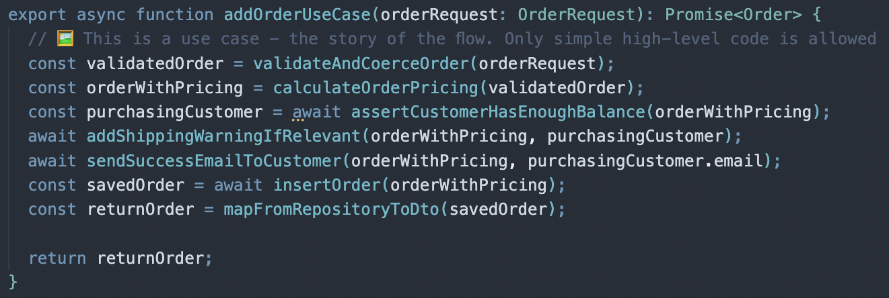
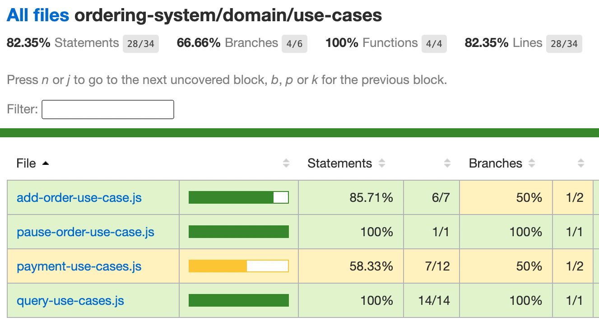

## Intro: A sweet pattern that got lost in time

When was the last time you introduced a new pattern to your code? The use-case pattern is a great candidate: it's powerful, sweet, easy to implement, and can strategically elevate your backend code quality in a short time. 

The term 'use case' means many different things in our industry. It's being used by product folks to describe a user journey, mentioned by various famous architecture books to describe vague high-level concepts. this article focuses on its practical application at the *code level* by emphasizing its surprising merits how to implement it correctly.

Technically, the use-case pattern code belongs between the controller (e.g., API routes) and the business logic services (like those calculating or saving data). The use-case code is called by the controller and tells in high-level words the flow that is about to happen in a simple manner. Doing so increases the code readability, navigability, pushes complexity toward the edges, improves observability and 3 other merits that are shown below with examples.

But before we delve into its mechanics, let's first touch on a common problem it aims to address and see some code that calls for trouble.

_Prefer a 10 min video? Watch here, or keep reading below_
<iframe width="1024" height="768" src="https://youtu.be/cuH9p2XLXSA" title="About the use-case code pattern" frameborder="0" allow="accelerometer; autoplay; clipboard-write; encrypted-media; gyroscope; picture-in-picture" allowfullscreen></iframe>


## The problem: too many details, too soon

Imagine a developer, returning to a codebase she hasn't touched in months, tasked with fixing a bug in the 'new orders flow'—specifically, an issue with price calculation in an electronic shop app.

Her journey begins promisingly smooth:

**- 🤗 Testing -** She starts her journey off the automated tests to learn about the flow from an outside-in approach. The testing code is short and standard, as should be:

```javascript
test("When adding an order with 100$ product, then the price charge should be 100$ ", async () => {
  // ....
})
```

**- 🤗 Controller -** She moves to skim through the implementation and starts from the API routes. Unsurprisingly, the Controller code is straightforward:

```javascript
app.post("/api/order", async (req: Request, res: Response) => {
  const newOrder = req.body;
  await orderService.addOrder(newOrder); // 👈 This is where the real-work is done
  res.status(200).json({ message: "Order created successfully" });
});
```

Smooth sailing thus far, almost zero complexity. Typically, the controller would now hand off to a Service where the real implementation begins, she navigates into the order service to find where and how to fix that pricing bug.

**- 😲 The service -** Suddenly! She is thrown into hundred lins of code (at best) with tons of details. She encounters classes with intricate states, inheritance hierarchies, a dependency injection framework that wire all the dependent services, and other boilerplate code. Here is a sneak peak from a real-world service, already simplified for brevity. Read it, feel it:

```javascript
let DBRepository;

export class OrderService : ServiceBase<OrderDto> {
  async addOrder(orderRequest: OrderRequest): Promise<Order> {
  try {
    ensureDBRepositoryInitialized();
    const { openTelemetry, monitoring, secretManager, priceService, userService } =
      dependencyInjection.getVariousServices();
    logger.info("Add order flow starts now", orderRequest);
    openTelemetry.sendEvent("new order", orderRequest);

    const validationRules = await getFromConfigSystem("order-validation-rules");
    const validatedOrder = validateOrder(orderRequest, validationRules);
    if (!validatedOrder) {
      throw new Error("Invalid order");
    }
    this.base.startTransaction();
    const user = await userService.getUserInfo(validatedOrder.customerId);
    if (!user) {
      const savedOrder = await tryAddUserWithLegacySystem(validatedOrder);
      return savedOrder;
    }
    // And it goes on and on until the pricing module is mentioned
}
```

So many details and things to learn upfront, which of them is crucial for her to learn now before dealing with her task? How can she find where is that pricing module?

She is not happy. Right off the bat, she must make herself acquaintance with a handful of product and technical narratives. She just fell off the complexity cliff: from a zero-complexity controller straight into a 1000-piece puzzle. Many of them are unrelated to her task.

## The use-case pattern 

In a perfect world, she would love first to get a high-level brief of the involved steps so she can understand the whole flow, and from this comfort standpoint choose where to deepen her journey. This is what this pattern is all about.

The use-case is a file with a single function that is being called by the API controller to orchestrate the various implementation services. It's merely a simple function that enumerates and calls the code that does the actual job:



Each interaction with the system—whether it's posting a new comment, requesting user deletion, or any other action—is managed by a dedicated use-case function. Each use-case constitutes multiple 'steps' - function calls that fulfill the desired flow.

By design, it's short, flat, no If/else, no try-catch, no algorithms, just plain calls to functions. This way, it tells the story in the simplest manner. Note how it doesn't share too much details, but tells enough for one to understand 'WHAT' is happening here and 'WHO' is doing that, but not 'HOW'.

But why is this minimalistic approach so crucial?

## The merits

### 1. A navigation index

When seeking a specific book in the local library, the visitor doesn't have to skim through all the shelves to find a specific topic of interest. A Library, like any other information system, uses a navigational system, wayfinding signage, to highlight the path to a specific information area.


*The library catalog redirects the reader to the area of interest*

Similarly, in software development, when a developer needs to address a particular issue—such as fixing a bug in pricing calculations—the 'use case' acts like a navigational tool within the application. It serves as a hitchhiker's guide, or the yellow pages, pinpointing exactly where to find the necessary piece of code. While other organizational strategies like modularization and folder structures offer ways to manage code, the 'use case' approach provides a more focused and precise index. it shows only the relevant areas (and not 50 unrelated modules), it tells *when precisely*  this module is used, what is the *specific* entry point and which *exact* parameters are passed.

 
### 2. Deferred and spread complexity

When a developer begins inspecting a codebase at the level of implementation services, she is immediately bombarded with intricate details. This immersion thrusts her into the depths of both product and technical complexities. Typically, she must navigate through a dependency injection system to instantiate classes, manage null states, and retrieve settings from a distributed configuration system

When the code reader's journey starts at the level of implementation-services, she is immediately bombarded with intricate details. This immersion exposes her to both product and technical complexities right from the start. Typically, like in our example case, the code first use a dependency injection system to factor some classes, check for nulls in the state and get some values from the distributed config system - all before even starting on the primary task. This is called *accidental complexity*. Tackling complexity is one of the finest art of app design, as the code planner you can't just eliminate complexity, but you may at least reduce the chances of someone meeting it.

Imagine your application as a tree where branches represent functions and the fruits are pockets of embedded complexity, some of which are poisoned (i.e., unnecessary complexities). Your objective is to structure this tree so that navigating through it exposes the visitor to as few poisoned fruits as possible:


*The accidental-complexity tree: A visitor aiming to reach a specific leaf must navigate through all the intervening poisoned fruits.*

This is where the 'Use Case' approach shines: by prioritizing high-level product steps and minimal technical details at the outset—a navigation system that simplifies access to various parts of the application. With this navigation tool, she can easily ignore steps that are unrelated with her work, and avoid poisoned fruits. A true strategic design win.


*The spread-complexity tree: Complexity is pushed to the periphery, allowing the reader to navigate directly to the essential fruits only.*


### 3. A practical workflow that promotes efficiency

When embarking on a new coding flow, where do you start? After digesting the requirements and setting up some initial API routes and high-level component tests, the next logical step might be less obvious. Here's a strategy: begin with a use-case. This approach promotes an outside-in workflow that not only streamlines development but also exposes potential risks early on.

While drafting a new use-case, you essentially map out the various steps of the process. Each step is a call to some service or repository functions, sometimes before they even exist. Effortlessly and spontaneously, these steps become your TODO list, a live document that tells not only what should be implemented rather also where risky gotchas hide. Take, for instance, this straightforward use-case for adding an order:


```javascript
export async function addOrderUseCase(orderRequest: OrderRequest) {
  const orderWithPricing = calculateOrderPricing(validatedOrder);
  const purchasingCustomer = await assertCustomerExists(orderWithPricing.customerId);
  const savedOrder = await insertOrder(orderWithPricing);
  await sendSuccessEmailToCustomer(savedOrder, purchasingCustomer.email);
}
```

This structured approach allows you to preemptively tackle potential implementation hurdles:

**- sendSuccessEmailToCustomer -** What if you lack a necessary email service token from the Ops team? Sometimes, this demands approval and might last more than a week (believe me, I know). Acting *now*, before spending 3 days on coding, can make a big difference.

**- calculateOrderPricing -** Reminds you to confirm pricing details with the product team—ideally before they're out of office, avoiding delays that could impact your delivery timeline.

**- assertCustomerExists -** This call goes to an external Microservice which belongs to the User Management team. Did they already provide an OpenAPI specification of their routes? Check your Slack now, if they didn't yet, asking too late can prevent it from becoming a roadblock later.

Not only does this high-level thinking highlight your tasks and risks, it's also an optimal spot to start the design from:

### 4. The optimal design viewpoint

Early on when initiating a use-case, the developers define the various types, functions signature, and their initial skeleton return data. This process naturally evolves into an effective design drill where the overall flow is decomposed into small units that actually fit. This sketch-out results in discovering early when puzzle pieces don't fit while considering the underlying technologies. Here is an example, once I sketched a use-case and initially came up with these steps:

```javascript
await sendSuccessEmailToCustomer(savedOrder, purchasingCustomer.email, orderId);
const savedOrder = await insertOrder(orderWithPricing);
```

Going with my initial use-case above, an email is sent before the the order is saved. Soon enough the compiler yelled at me: The email function signature is not satisfied, an 'Order Id' parameter is needed but to obtain one the order must be saved to DB first. I tried to change the order, unfortunately it turned out that my ORM is not returning the ID of saved entities. I'm stuck, my design struggles, at least this is realized before spending days on details. Unlike designing with papers and UML, designing with use-case brings no overhead. Moreover, unlike high-level diagrams detached from implementation realities, use-case design is grounded in the actual constraints of the technology being used.


### 5. Better coverage reports

Say you have 82.35% testing code coverage, are you happy and feeling confident to deploy? I'd suggest that anyone having below 100% must clarify first which code *exactly* is not covered with testing. Is this some nitty-gritty niche code or actually critical business operations that are not fully tested? Typically, answering this requires scrutinizing all the app file coverage, a daunting task.

Use-cases simplifies the coverage coverage digest: when looking directly into the use-cases folder, one gets *'features coverage'*, a unique look into which user features and steps lack testing:


*The use-cases folder test coverage report, some use-cases are only partially tested*

See how the code above has an excellent overall coverage, 82.35%. But what about the remaining 17.65% code? Looking at the report triggers a red flag: the unusual 'payment-use-case' is not tested. This flow is where revenues are generated, a critical financial process which as turns out has a very low test coverage. This significant observation calls for immediate actions. Use-case coverage thus not only helps in understanding what parts of your application are tested but also prioritizes testing efforts based on business criticality rather than mere technical functionality.

### 6. Practical domain-driven code

The influential book "Domain-Driven Design" advocates for "committing the team to relentlessly exercise the domain language in all communications within the team and in the code." This principle asserts that aligning code closely with product narratives fosters a common language among diverse stakeholders (e.g., product, team-leads, frontend, backend). While this sounds sensible, this advice is also a little vague - how and where should this happen?

Use-cases bring this idea down to earth: the use-case files are named after user journeys in the system (e.g., purchase-new-goods), the use-case code itself naturally describes the flow in a product language. For instance, if employees commonly use the term 'cut' at the water cooler to refer to a price reduction, the corresponding use-case should employ a function named 'calculatePriceCut'. This naming convention not only reinforces the domain language but also enhances mutual understanding across the team.

### 7. Consistent observability

I bet you encountered the situation when you turn the log level to 'Debug' (or any other verbose mode) and gets gazillion, overwhelming, and unbearable amount of log statements. Great chances that you also met the opposite when setting the logger level to 'Info' but there are also almost zero logging for that specific route that you're looking into. It's hard to formalize among team members when exactly each type of logging should be invoked, the result is a typical inconsistent and lacking observability.

Use-cases can drive trustworthy and consistent monitoring by taking advantage of the produced use-case steps. Since the precious work of breaking-down the flow into meaningful steps was already done (e.g., send-email, charge-credit-card), each step can produce the desired level of logging. For example, one team's approach might be to emit logger.info on a use-case start and use-case end, and then each step will emit logger.debug. Whatever the chosen specific level is, use-case steps bring consistency and automation. Put aside logging, the same can be applied with any other observability technique like OpenTelemetry to produce custom spans for every flow step.

The implementation though demands some thinking, cluttering every step with a log statement is both verbose and depends on human manual work:

```javascript
// ❗️Verbose use case
export async function addOrderUseCase(orderRequest: OrderRequest): Promise<Order> {
  logger.info("Add order use case - Adding order starts now", orderRequest);
  const validatedOrder = validateAndCoerceOrder(orderRequest);
  logger.debug("Add order use case - The order was validated", validatedOrder);
  const orderWithPricing = calculateOrderPricing(validatedOrder);
  logger.debug("Add order use case - The order pricing was decided", validatedOrder);
  const purchasingCustomer = await assertCustomerHasEnoughBalance(orderWithPricing);
  logger.debug("Add order use case - Verified the user balance already", purchasingCustomer);
  const returnOrder = mapFromRepositoryToDto(purchasingCustomer as unknown as OrderRecord);
  logger.info("Add order use case - About to return result", returnOrder);
  return returnOrder;
}
```

One way around this is creating a step wrapper function that makes it observable. This wrapper function will get called for each step:

```javascript
import { openTelemetry } from "@opentelemetry";
async function runUseCaseStep(stepName, stepFunction) {
  logger.debug(`Use case step ${stepName} starts now`);
  // Create Open Telemetry custom span
  openTelemetry.startSpan(stepName);
  return await stepFunction();
}
```

Now the use-case gets automated and consistent transparency:

```javascript
export async function addOrderUseCase(orderRequest: OrderRequest) {
  // 🖼 This is a use case - the story of the flow. Only simple, flat and high-level code is allowed
  const validatedOrder = await runUseCaseStep("Validation", validateAndCoerceOrder.bind(null, orderRequest));
  const orderWithPricing = await runUseCaseStep("Calculate price", calculateOrderPricing.bind(null, validatedOrder));
  await runUseCaseStep("Send email", sendSuccessEmailToCustomer.bind(null, orderWithPricing));
}
```

The code is a little simplified, in real-world wrapper you'll have to put try-catch and cover other corner cases, but it makes the point: each step is a meaningful milestone in the user's journey that gets *automated and consistent* observability.

## Implementation best practices

### 1. Dead-simple 'no code'

Since use-cases are mostly about zero complexity, use no code constructs but flat calls to functions. No If/Else, no switch, no try/catch, nothing, only a simple list of steps. While ago I decided to put *only one* If/Else in a use-case: 

```javascript
export async function addOrderUseCase(orderRequest: OrderRequest) {
  const validatedOrder = validateAndCoerceOrder(orderRequest);
  const purchasingCustomer = await assertCustomerHasEnoughBalance(validatedOrder);
  if (purchasingCustomer.isPremium) {//❗️
    sendEmailToPremiumCustomer(purchasingCustomer);
    // This easily will grow with time to multiple if/else
  }
}
```

A month later when I visited the code above there were already three nested If/elses. Year from now the function above will host a typical imperative code with many nested branches. Avoid this slippery road by putting a very strict border, put the conditions within the step functions:


```javascript
export async function addOrderUseCase(orderRequest: OrderRequest) {
  const validatedOrder = validateAndCoerceOrder(orderRequest);
  const purchasingCustomer = await assertCustomerHasEnoughBalance(validatedOrder);
  await sendEmailIfPremiumCustomer(purchasingCustomer); //🙂
}
```

### 2. Find the right level of specificity

The finest art of a great use case is finding the right level of details. At this early stage, the reader is like a traveler who uses the map to get some sense of the area, or find a specific road. Definitely not learn about every road in the country. On the other hand, a good map doesn't show only the main highway and nothing else. For example, the following use-case is too short and vague:

```javascript
export async function addOrderUseCase(orderRequest: OrderRequest) {
  const validatedOrder = validateAndCoerceOrder(orderRequest);
  const finalOrderToSave = await applyAllBusinessLogic(validatedOrder);//🤔
  await insertOrder(finalOrderToSave);
}
```

The code above doesn't tell a story, neither eliminate some paths from the journey. Conversely, the following code is doing better in telling the story brief:

```javascript
export async function addOrderUseCase(orderRequest: OrderRequest) {
  const validatedOrder = validateAndCoerceOrder(orderRequest);
  const pricedOrder = await calculatePrice(validatedOrder);
  const purchasingCustomer = await assertCustomerHasEnoughBalance(orderWithPricing);
  const orderWithShippingInstructions = await addShippingInfo(pricedOrder, purchasingCustomer);
  await insertOrder(orderWithShippingInstructions);
}
```

Things get a little more challenging when dealing with long flows. What if there a handful of important steps, say 20? what if multiple use-case have a lot of repetition and shared step? Consider the case where 'admin approval' is a multi-step process which is invoked by a handful of different use-cases? When facing this, consider breaking-down into multiple use-cases where one is allowed to call the other.

### 3. When have no choice, control the DB transaction from the use-case

What if step 2 and step 5 both deal with data and must be atomic (fail or succeed together)? Typically you'll handle this with DB transactions, but since each step is discrete, how can a transaction be shared among the coupled steps?

If the steps take place one after the other, it makes sense to let the downstream service/repository handle them together and abstract the transaction from the use-case. What if the atomic steps are not consecutive? In this case, though not ideal, there is no escape from making the use-case acquaintance with a transaction object:

```javascript
export async function addOrderUseCase(orderRequest: OrderRequest) {
  // 🖼 This is a use case - the story of the flow. Only simple, flat and high-level code is allowed
  const transaction = Repository.startTransaction();
  const purchasingCustomer = await assertCustomerHasEnoughBalance(orderRequest, transaction);
  const orderWithPricing = calculateOrderPricing(purchasingCustomer);
  const savedOrder = await insertOrder(orderWithPricing, transaction);
  const returnOrder = mapFromRepositoryToDto(savedOrder);
  Repository.commitTransaction(transaction);
  return returnOrder;
}
```

### 4. Aggregate small use-cases in a single file

A use-case file is created per user-flow that is triggered from an API route. This model make sense for significant flows, how about small operations like getting an order by id? A 'get-order-by-id' use case is likely to have 1 line of code, seems like an unnecessary overhead to create a use-case file for every small request. In this case, consider aggregating multiple operations under a single conceptual use-case file. Here below for example, all the order queries co-live under the query-orders use-case file:

```javascript
// query-orders-use-cases.ts
export async function getOrder(id) {
  // 🖼 This is a use case - the story of the flow. Only simple, flat and high-level code is allowed
  const result = await orderRepository.getOrderByID(id);
  return result;
}

export async function getAllOrders(criteria) {
  // 🖼 This is a use case - the story of the flow. Only simple, flat and high-level code is allowed
  const result = await orderRepository.queryOrders(criteria);
  return result;
}
```

## Closing: Easy to start, use everywhere

If you find it valuable, you'll also get great return for your modest investment: No fancy tooling is needed, the learning time is close to zero (in fact, you just read one of the longest article on this matter...). There is also no need to refactor a whole system rather gradually implement per-feature.

Once you become accustomed to using it, you'll find that this technique extends well beyond API routes. It's equally beneficial for managing message queues subscriptions and scheduled jobs. Backend-aside, use it as the facade of every module or library - the code that is being called by the entry file and orchestrates the internals. The same idea can be applied in Frontend as well: declare the core actors at the component top level. Without implementation details, just put the reference to the component's event handlers and hooks - now the reader knows about the key events that will drive this component.

You might think this all sounds remarkably straightforward—and it is. My apologies, this article wasn't about cutting-edge technologies. Neither did it cover shiny new dev toolings or AI-based rocket-science. In a land where complexity is the key enemy, simple ideas can be more impactful than sophisticated tooling and the Use-case is a powerful and sweet pattern that meant to live in every piece of software.
