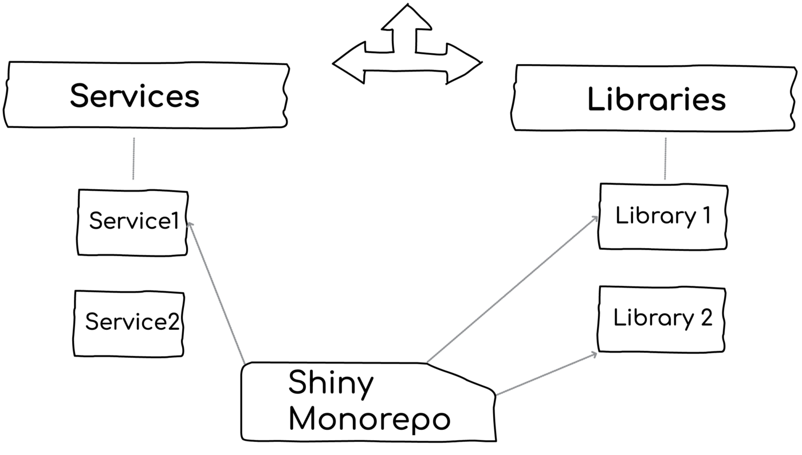

# Which Monorepo is right for a Node.js BACKEND now?

As a Node.js starter, choosing the right libraries and frameworks for our users is the bread and butter of our work in [Practica.js](https://github.com/practicajs/practica). In this post, we'd like to share our considerations in choosing our monorepo tooling

## What are we looking at

The Monorepo market is hot like fire. Weirdly, now when the demand for Monoreps is exploding, one of the leading libraries —  [Lerna- has just retired.](https://github.com/lerna/lerna/issues/2703)  When looking closely, it might not be just a coincidence — With so many disruptive and shiny features brought on by new vendors, Lerna failed to keep up with the pace and stay relevant. This bloom of new tooling gets many confused — What is the right choice for my next project? What should I look at when choosing a Monorepo tool? This post is all about curating this information overload, covering the new tooling, emphasizing what is important, and finally share some recommendations. If you are here for tools and features, you’re in the right place, although you might find yourself on a soul-searching journey to what is your desired development workflow.

This post is concerned with backend-only and Node.js. It also scoped to  _typical_  business solutions. If you’re Google/FB developer who is faced with 8,000 packages — sorry, you need special gear. Consequently, monster Monorepo tooling like  [Bazel](https://github.com/thundergolfer/example-bazel-monorepo)  is left-out. We will cover here some of the most popular Monorepo tools including Turborepo, Nx, PNPM, Yarn/npm workspace, and Lerna (although it’s not actually maintained anymore — it’s a good baseline for comparison).

Let’s start? When human beings use the term Monorepo, they typically refer to one or more of the following  _4 layers below._ Each one of them can bring value to your project, each has different consequences, tooling, and features:

<!--truncate-->

# Layer 1: Plain old folders to stay on top of your code

With zero tooling and only by having all the Microservice and libraries together in the same root folder, a developer gets great management perks and tons of value: Navigation, search across components, deleting a library instantly, debugging,  _quickly_  adding new components. Consider the alternative with multi-repo approach — adding a new component for modularity demands opening and configuring a new  GitHub  repository. Not just a hassle but also greater chances of developers choosing the short path and including the new code in some semi-relevant existing package. In plain words, zero-tooling Monorepos can increase modularity.

This layer is often overlooked. If your codebase is not huge and the components are highly decoupled (more on this later)— it might be all you need. We’ve seen a handful of successful Monorepo solutions without any special tooling.

With that said, some of the newer tools augment this experience with interesting features:

-   Both  [Turborepo](https://turborepo.org/)  and  [Nx](https://nx.dev/structure/dependency-graph)  and also  [Lerna](https://www.npmjs.com/package/lerna-dependency-graph)  provide a visual representation of the packages’ dependencies
-   [Nx allows ‘visibility rules’](https://nx.dev/structure/monorepo-tags)  which is about enforcing who can use what. Consider, a ‘checkout’ library that should be approached only by the ‘order Microservice’ — deviating from this will result in failure during development (not runtime enforcement)

Nx dependencies graph

-   [Nx workspace generator](https://nx.dev/generators/workspace-generators)  allows scaffolding out components. Whenever a team member needs to craft a new controller/library/class/Microservice, she just invokes a CLI command which products code based on a community or organization template. This enforces consistency and best practices sharing

# Layer 2: Tasks and pipeline to build your code efficiently

Even in a world of autonomous components, there are management tasks that must be applied in a batch like applying a security patch via npm update, running the tests of  _multiple_  components that were affected by a change, publish 3 related libraries to name a few examples. All Monorepo tools support this basic functionality of invoking some command over a group of packages. For example, Lerna, Nx, and Turborepo do.

Apply some commands over multiple packages

In some projects, invoking a cascading command is all you need. Mostly if each package has an autonomous life cycle and the build process spans a single package (more on this later). In some other types of projects where the workflow demands testing/running and publishing/deploying many packages together — this will end in a terribly slow experience. Consider a solution with hundred of packages that are transpiled and bundled — one might wait minutes for a wide test to run. While it’s not always a great practice to rely on wide/E2E tests, it’s quite common in the wild. This is exactly where the new wave of Monorepo tooling shines —  _deeply_  optimizing the build process. I should say this out loud: These tools bring beautiful and innovative build optimizations:

-   **Parallelization —** If two commands or packages are orthogonal to each other, the commands will run in two different threads or processes. Typically your quality control involves testing, lining, license checking, CVE checking — why not parallelize?
-   **Smart execution plan —**Beyond parallelization, the optimized tasks execution order is determined based on many factors. Consider a build that includes A, B, C where A, C depend on B — naively, a build system would wait for B to build and only then run A & C. This can be optimized if we run A & C’s  _isolated_  unit tests  _while_ building B and not afterward. By running task in parallel as early as possible, the overall execution time is improved — this has a remarkable impact mostly when hosting a high number of components. See below a visualization example of a pipeline improvement

A modern tool advantage over old Lerna. Taken from Turborepo website

-   **Detect who is affected by a change —**  Even on a system with high coupling between packages, it’s usually not necessary to run  _all_ packages rather than only those who are affected by a change. What exactly is ‘affected’? Packages/Microservices that depend upon another package that has changed. Some of the toolings can ignore minor changes that are unlikely to break others. This is not a great performance booster but also an amazing testing feature —developers can get quick feedback on whether any of their clients were broken. Both Nx and Turborepo support this feature. Lerna can tell only which of the Monorepo package has changed
-   **Sub-systems (i.e., projects) —** Similarly to ‘affected’ above, modern tooling can realize portions of the graph that are inter-connected (a project or application) while others are not reachable by the component in context (another project) so they know to involve only packages of the relevant group
-   **Caching —** This is a serious speed booster: Nx and Turborepo cache the result/output of tasks and avoid running them again on consequent builds if unnecessary. For example, consider long-running tests of a Microservice, when commanding to re-build this Microservice, the tooling might realize that nothing has changed and the test will get skipped. This is achieved by generating a hashmap of all the dependent resources — if any of these resources haven’t change, then the hashmap will be the same and the task will get skipped. They even cache the stdout of the command, so when you run a cached version it acts like the real thing — consider running 200 tests, seeing all the log statements of the tests, getting results over the terminal in 200 ms, everything acts like ‘real testing while in fact, the tests did not run at all rather the cache!
-   **Remote caching —** Similarly to caching, only by placing the task’s hashmaps and result on a global server so further executions on other team member’s computers will also skip unnecessary tasks. In huge Monorepo projects that rely on E2E tests and must build all packages for development, this can save a great deal of time

# Layer 3: Hoist your dependencies to boost npm installation

The speed optimizations that were described above won’t be of help if the bottleneck is the big bull of mud that is called ‘npm install’ (not to criticize, it’s just hard by nature). Take a typical scenario as an example, given dozens of components that should be built, they could easily trigger the installation of thousands of sub-dependencies. Although they use quite similar dependencies (e.g., same logger, same ORM), if the dependency version is not equal then npm will duplicate ([the NPM doppelgangers problem](https://rushjs.io/pages/advanced/npm_doppelgangers/)) the installation of those packages which might result in a long process.

This is where the workspace line of tools (e.g., Yarn workspace, npm workspaces, PNPM) kicks in and introduces some optimization — Instead of installing dependencies inside each component ‘NODE_MODULES’ folder, it will create one centralized folder and link all the dependencies over there. This can show a tremendous boost in install time for huge projects. On the other hand, if you always focus on one component at a time, installing the packages of a single Microservice/library should not be a concern.

Both Nx and Turborepo can rely on the package manager/workspace to provide this layer of optimizations. In other words, Nx and Turborepo are the layer above the package manager who take care of optimized dependencies installation.

On top of this, Nx introduces one more non-standard, maybe even controversial, technique: There might be only ONE package.json at the root folder of the entire Monorepo. By default, when creating components using Nx, they will not have their own package.json! Instead, all will share the root package.json.  Going this way, all the Microservice/libraries share their dependencies and the installation time is improved.  Note: It’s possible to create ‘publishable’ components that do have a package.json, it’s just not the default.

I’m concerned here. Sharing dependencies among packages increases the coupling, what if Microservice1 wishes to bump dependency1 version but Microservice2 can’t do this at the moment? Also, package.json is part of Node.js  _runtime_ and excluding it from the component root loses important features like package.json main field or ESM exports (telling the clients which files are exposed). I ran some POC with Nx last week and found myself blocked — library B was wadded, I tried to import it from Library A but couldn’t get the ‘import’ statement to specify the right package name. The natural action was to open B’s package.json and check the name, but there is no Package.json… How do I determine its name? Nx docs are great, finally, I found the answer, but I had to spend time learning a new ‘framework’.

# Stop for a second: It’s all about your workflow

We deal with tooling and features, but it’s actually meaningless evaluating these options before determining whether your preferred workflow is  _synchronized or independent_ (we will discuss this in a few seconds)_._ This upfront  _fundamental_  decision will change almost everything.

Consider the following example with 3 components: Library 1 is introducing some major and breaking changes, Microservice1 and Microservice2 depend upon Library1 and should react to those breaking changes. How?

**Option A — The synchronized workflow-** Going with this development style, all the three components will be developed and deployed in one chunk  _together_. Practically, a developer will code the changes in Library1, test libray1 and also run wide integration/e2e tests that include Microservice1 and Microservice2. When they're ready, the version of all components will get bumped. Finally, they will get deployed  _together._

Going with this approach, the developer has the chance of seeing the full flow from the client's perspective (Microservice1 and 2), the tests cover not only the library but also through the eyes of the clients who actually use it. On the flip side, it mandates updating all the depend-upon components (could be dozens), doing so increases the risk’s blast radius as more units are affected and should be considered before deployment. Also, working on a large unit of work demands building and testing more things which will slow the build.

**Option B — Independent workflow-** This style is about working a unit by unit, one bite at a time, and deploy each component independently based on its personal business considerations and priority. This is how it goes: A developer makes the changes in Library1, they must be tested carefully in the scope of Library1. Once she is ready, the SemVer is bumped to a new major and the library is published to a package manager registry (e.g., npm). What about the client Microservices? Well, the team of Microservice2 is super-busy now with other priorities, and skip this update for now (the same thing as we all delay many of our npm updates,). However, Microservice1 is very much interested in this change — The team has to pro-actively update this dependency and grab the latest changes, run the tests and when they are ready, today or next week — deploy it.

Going with the independent workflow, the library author can move much faster because she does not need to take into account 2 or 30 other components — some are coded by different teams. This workflow also  _forces her_  to write efficient tests against the library — it’s her only safety net and is likely to end with autonomous components that have low coupling to others. On the other hand, testing in isolation without the client’s perspective loses some dimension of realism. Also, if a single developer has to update 5 units — publishing each individually to the registry and then updating within all the dependencies can be a little tedious.

Synchronized and independent workflows illustrated

**On the illusion of synchronicity**

In distributed systems, it’s not feasible to achieve 100% synchronicity — believing otherwise can lead to design faults. Consider a breaking change in Microservice1, now its client Microservice2 is adapting and ready for the change. These two Microservices are deployed together but due to the nature of Microservices and distributed runtime (e.g., Kubernetes) the deployment of Microservice1 only fail. Now, Microservice2’s code is not aligned with Microservice1 production and we are faced with a production bug. This line of failures can be handled to an extent also with a synchronized workflow — The deployment should orchestrate the rollout of each unit so each one is deployed at a time. Although this approach is doable, it increased the chances of large-scoped rollback and increases deployment fear.

This fundamental decision, synchronized or independent, will determine so many things — Whether performance is an issue or not at all (when working on a single unit), hoisting dependencies or leaving a dedicated node_modules in every package’s folder, and whether to create a local link between packages which is described in the next paragraph.

# Layer 4: Link your packages for immediate feedback

When having a Monorepo, there is always the unavoidable dilemma of how to link between the components:

**Option 1: Using npm —** Each library is a standard npm package and its client installs it via the standards npm commands. Given Microservice1 and Library1, this will end with two copies of Library1: the one inside Microservices1/NODE_MODULES (i.e., the local copy of the consuming Microservice), and the 2nd is the development folder where the team is coding Library1.

**Option2: Just a plain folder —** With this, Library1 is nothing but a logical module inside a folder that Microservice1,2,3 just locally imports. NPM is not involved here, it’s just code in a dedicated folder. This is for example how Nest.js modules are represented.

With option 1, teams benefit from all the great merits of a package manager — SemVer(!), tooling, standards, etc. However, should one update Library1, the changes won’t get reflected in Microservice1 since it is grabbing its copy from the npm registry and the changes were not published yet. This is a fundamental pain with Monorepo and package managers — one can’t just code over multiple packages and test/run the changes.

With option 2, teams lose all the benefits of a package manager: Every change is propagated immediately to all of the consumers.

How do we bring the good from both worlds (presumably)? Using linking. Lerna, Nx, the various package manager workspaces (Yarn, npm, etc) allow using npm libraries and at the same time link between the clients (e.g., Microservice1) and the library. Under the hood, they created a symbolic link. In development mode, changes are propagated immediately, in deployment time — the copy is grabbed from the registry.

Linking packages in a Monorepo

If you’re doing the synchronized workflow, you’re all set. Only now any risky change that is introduced by Library3, must be handled NOW by the 10 Microservices that consume it.

If favoring the independent workflow, this is of course a big concern. Some may call this direct linking style a ‘monolith monorepo’, or maybe a ‘monolitho’. However, when not linking, it’s harder to debug a small issue between the Microservice and the npm library. What I typically do is  _temporarily link_ (with npm link) between the packages_,_  debug, code, then finally remove the link.

Nx is taking a slightly more disruptive approach — it is using  [TypeScript paths](https://www.typescriptlang.org/tsconfig#paths)  to bind between the components. When Microservice1 is importing Library1, to avoid the full local path, it creates a TypeScript mapping between the library name and the full path. But wait a minute, there is no TypeScript in production so how could it work? Well, in serving/bundling time it webpacks and stitches the components together. Not a very standard way of doing Node.js work.

# Closing: What should you use?

It’s all about your workflow and architecture — a huge unseen cross-road stands in front of the Monorepo tooling decision.

**Scenario A —** If your architecture dictates a  _synchronized workflow_  where all packages are deployed together, or at least developed in collaboration — then there is a strong need for a rich tool to manage this coupling and boost the performance. In this case, Nx might be a great choice.

For example, if your Microservice must keep the same versioning, or if the team really small and the same people are updating all the components, or if your modularization is not based on package manager but rather on framework-own modules (e.g., Nest.js), if you’re doing frontend where the components inherently are published together, or if your testing strategy relies on E2E mostly — for all of these cases and others, Nx is a tool that was built to enhance the experience of coding many  _relatively_ coupled components together. It is a great a sugar coat over systems that are unavoidably big and linked.

If your system is not inherently big or meant to synchronize packages deployment, fancy Monorepo features might increase the coupling between components. The Monorepo pyramid above draws a line between basic features that provide value without coupling components while other layers come with an architectural price to consider. Sometimes climbing up toward the tip is worth the consequences, just make this decision consciously.

**Scenario B—** If you’re into an  _independent workflow_ where each package is developed, tested, and deployed (almost) independently — then inherently there is no need to fancy tools to orchestrate hundreds of packages. Most of the time there is just one package in focus. This calls for picking a leaner and simpler tool — Turborepo. By going this route, Monorepo is not something that affects your architecture, but rather a scoped tool for faster build execution. One specific tool that encourages an independent workflow is  [Bilt](https://github.com/giltayar/bilt)  by Gil Tayar, it’s yet to gain enough popularity but it might rise soon and is a great source to learn more about this philosophy of work.

**In any scenario, consider workspaces —** If you face performance issues that are caused by package installation, then the various workspace tools Yarn/npm/PNPM, can greatly minimize this overhead with a low footprint. That said, if you’re working in an autonomous workflow, smaller are the chances of facing such issues. Don’t just use tools unless there is a pain.

We tried to show the beauty of each and where it shines. If we’re allowed to end this article with an opinionated choice: We greatly believe in an independent and autonomous workflow where the occasional developer of a package can code and deploy fearlessly without messing with dozens of other foreign packages. For this reason, Turborepo will be our favorite tool for the next season. We promise to tell you how it goes.

# Bonus: Comparison table

See below a detailed comparison table of the various tools and features:

Preview only, the complete table can be  [found here](https://github.com/practicajs/practica/blob/main/docs/docs/decisions/monorepo.md)
